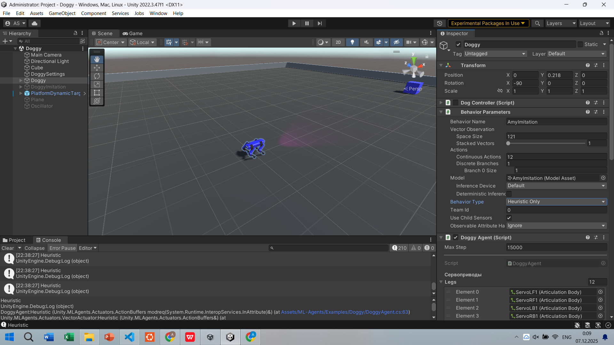
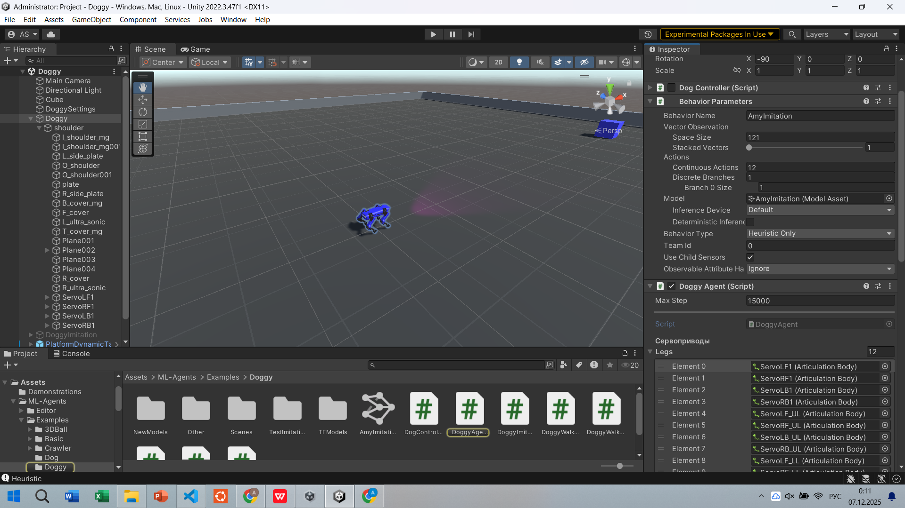

# Домашнее задание 2
# Цель задания: обучить робособаку добираться до цели в Unity ML-Agents
1. Инструкция по установке находится в той же папке.
2. Среда находится в папке ml-agents-develop\ml-agents-develop\Project.
3. При загрузке должна появиться сцена:
 
4. Нужно изменить файл тренировки DoggyAgent.cs, задав правильные награды.

5. Модель для тренировки должна находиться в поле Model (изначально поле пустое если тренировка первая), для тренировки модели используется режим Default в поле Behaviour type.
Чтобы проверить модель, вставьте ее в поле Model, включите режим Inference Only и запустите сцену. Для тестирования можно использовать режим Heuristic Only, функция тестирования Heuristic находится в DoggyAgent.cs

6. Обучите робособаку уверенно добираться до куба, загрузите итоговую модель, DoggyAgent.cs и сохраненные логи с наградами из терминала. 
7. Мягкий дедлайн: 17 декабря 23:59, жесткий дедлайн: 24 декабря 23:59